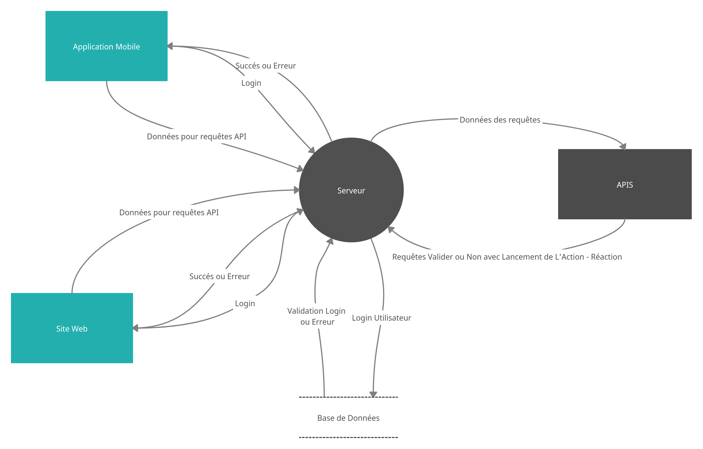

# AREA

## Le projet

L'AREA est un projet mélant Action et Réaction par l'intermediaire d'une application mobile ainsi que d'un site web

# Les Technologies utilisées

## Serveur

NestJS et Rest Api

## Base de données

Firebase

## Site web

ReactJS

## Application Mobile

Flutter et Dart

# Lancer le projet

## Avec Docker

sudo docker-compose build && sudo docker-compose up

http://localhost:8081

ou 

installer apk sur emulateur ou telephone

## Sans docker

cd server
npm start

Web: http://localhost:8081

App Mobile: -> ouvrir un autre terminal
            -> cd Area_Flutter_App
            -> flutter run
